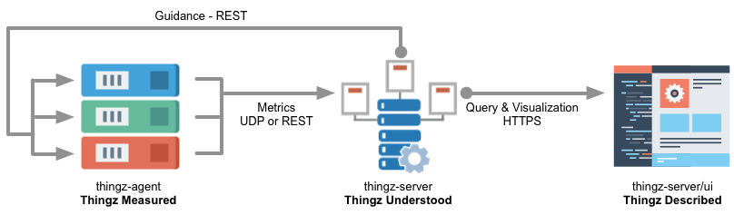
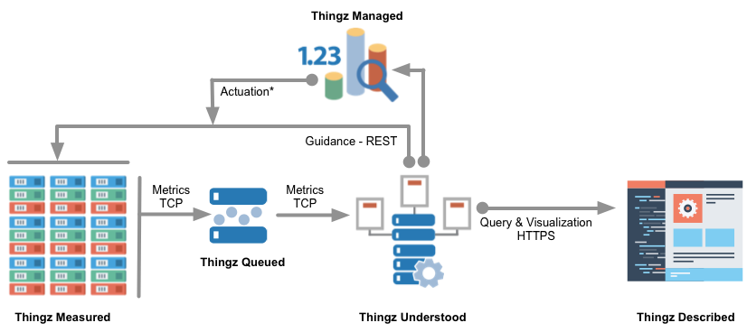

# thingz-server

> Thingz understood

This server works in tandem with the [thingz-agent](https://github.com/mchmarny/thingz-agent) to provide demonstration of both the dynamic modeling to support actuation as well as forensic query and visualization.

## Topology

### Simple Deployment

For smaller deployments (<200 thingz) the agents can report directly to the `thingz-server` over either UDP or REST



### Scaled Deployment

For larger deployments, or for situations where an external scheduler will be involved, the `thingz-agent` should be configured to report to a Message Bus (Apache Kafka) from where `thingz-server` will pick up metrics.



## UI - Dynamic Queries


Things series follow simple tag/value naming convention

```
src.*.dim.*.met.*
```

* `src` - is the source of the event (ip-172-31-11-155)
* `dim` - is the dimension of this series event (CPU)
* `met` - is the event metric (idle)

> Note, the series names are index and support regular expression

Knowing this convention, you can structure your series query across either multiple sources and metrics or on a specific metric in a single source


### List available series

Let's start by something simple, list thingz series.

```
select * from /.*/ limit 1
```

### List specific metric in all series

For something more challenging, query mean memory reported from all sources over last `1h` grouped by time

```
select mean(value) from /^src.*.dim.mem.met.actual-used/ where time > now() -1h group by time(1m)
```

### List all metrics for specific dimension on all sources

List all metrics reported over last `hour` in `5min` groups

```
select count(value),
       min(value),
       PERCENTILE(value, 25) as p25,
       mean(value),
       PERCENTILE(value, 75) as p75,
       max(value),
       last(value)
from /^src.ip-*/
where time > now() - 1h
group by time(5m)
```

### Speeding things up a bit

More complex queries on demand will eventually get slower. You can however assure consistent performance by creating continuous query which will pre-compute expensive queries into another series and keep it up to date in real-time.

Here is for example a continuous down-sampling of many series for a single metric:

```
select last(value),
       median(value)
from /^src.*.dim.mem.met.actual-used/
group by time(1m)
into 1m.:series_name
```

Once the continuous query is created, you can execute it for each one of the series with an instant response

```
select * from src.ip-172-31-21-3.dim.mem.met.actual-used
where time > now() - 1h
```

### Querying Through the HTTP API

Querying Thingz is also possible through REST API. Simply execute a GET to /db/thingz/series?q=<query>&u=<user>&p=<pass>. Here is a simple CURL example:

```
curl -G "http://$THINGZ_HOST:8086/db/thingz/series?u=agent&p=$THINGZ_SECRET&pretty=true" --data-urlencode "q=select count(value)from /^src.*/"
```

## UI - Charting

Once the server is installed you can build your own charts using [Grafana](http://grafana.org/). A sample dashboard configuration file is located in `/scripts/grafana-dashboard.json`


## API

### Dynamic Modeling

```
GetFilter [GET] - /api/v1.0/filters/{src}
```

Provides dynamic criteria information to aid `things-agent` pre-filtering at the edge.

```
{
    "ts": 1419878794,
    "nextCheck": 1419882394,
    "totalDimensions": 23,
    "hasMore": false,
    "dimensions": [
        {
            "dimension": "cpu",
            "metric": "idle",
            "filter": {
                "below": 73975,
                "above": 73965
            }
        },
        {
            "dimension": "cpu",
            "metric": "nice",
            "filter": {
                "below": 7562,
                "above": 7561
            }
        },...
```

### Actuation Guidance

```
GetSourcesByUtilization [GET] - /api/v1.0/util/{dimension}/{metric}/{min}
```

Provides guidance for placement based on specific dimension and metric over indicated period in minutes

```
{
    "ts": 1419878920,
    "period": {
        "from": 1419878920,
        "to": 1419882520
    },
    "criteria": "total cpu utilization over last 60 min",
    "method": "median",
    "resources": [
        {
            "src": "ip-172-31-11-156",
            "val": 16126108
        },
        {
            "src": "ip-172-31-11-155",
            "val": 16126335
        },
        {
            "src": "ip-172-31-3-206",
            "val": 16426783
        }
    ]
}
```


