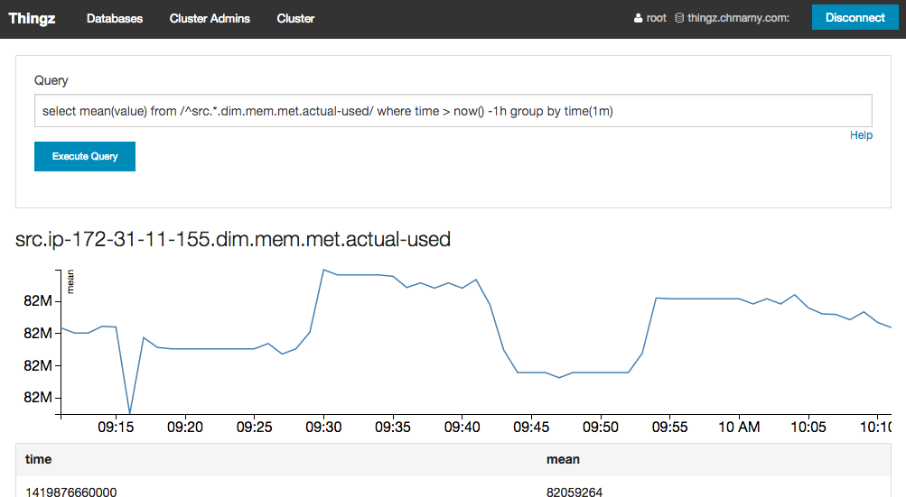
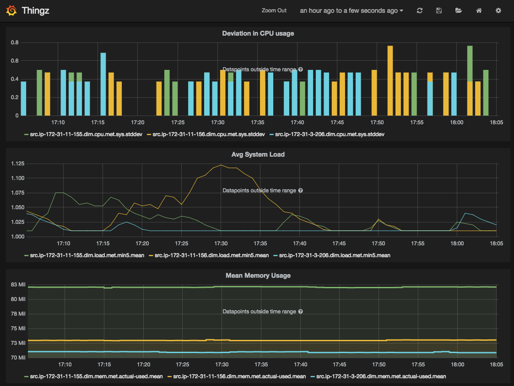

# thingz-server

Thingz understood


## Queries



Things series follow simple tag/value naming convention

```
src.*.dim.*.met.*
```

* `src` - is the source of the event (ip-172-31-11-155)
* `dim` - is the dimension of this series event (CPU)
* `met` - is the event metric (idle)

> Note, the series names are index and support regular expression 

Knowing this convention, you can structure your series query across either multiple sources and metrics or on a specific metric in a single source


### List available series

Let's start by something simple, list thingz series.

```
select * from /.*/ limit 1
```

### List specific metric in all series 

For something more challenging, query mean memory reported from all sources over last `1h` grouped by time

```
select mean(value) from /^src.*.dim.mem.met.actual-used/ where time > now() -1h group by time(1m)
```

### List all metrics for specific dimension on all sources

List all CPU metrics reported over last `hour` in `5min` groups

```
select min(value) as MinVal,
       PERCENTILE(value, 25) as LowPercentile,
       mean(value) as MedVal,
       PERCENTILE(value, 75) as HighPercentile,
       max(value) as MaxVal
from /^src.*.dim.cpu.met.*/
where time > now() - 1h
group by time(5m)
```

### Speeding things up a bit

Continuous queries let us pre-compute expensive select into another time series in real-time. Here is for example a continuous down-sampling of many series for a single host:

```
select min(value) as MinVal,
       PERCENTILE(value, 25) as LowPercentile,
       mean(value) as MedVal,
       PERCENTILE(value, 75) as HighPercentile,
       max(value) as MaxVal
from /^src.*.dim.cpu.met.*/
group by time(5m)
into 5m.:series_name
```

Now we can execute the complex query for each series from that host with an instant response

```
select * from /^5m.demo.*/ limit 1
```

## Charts

Once the server is installed you can build your own charts using [Grafana](http://grafana.org/)

